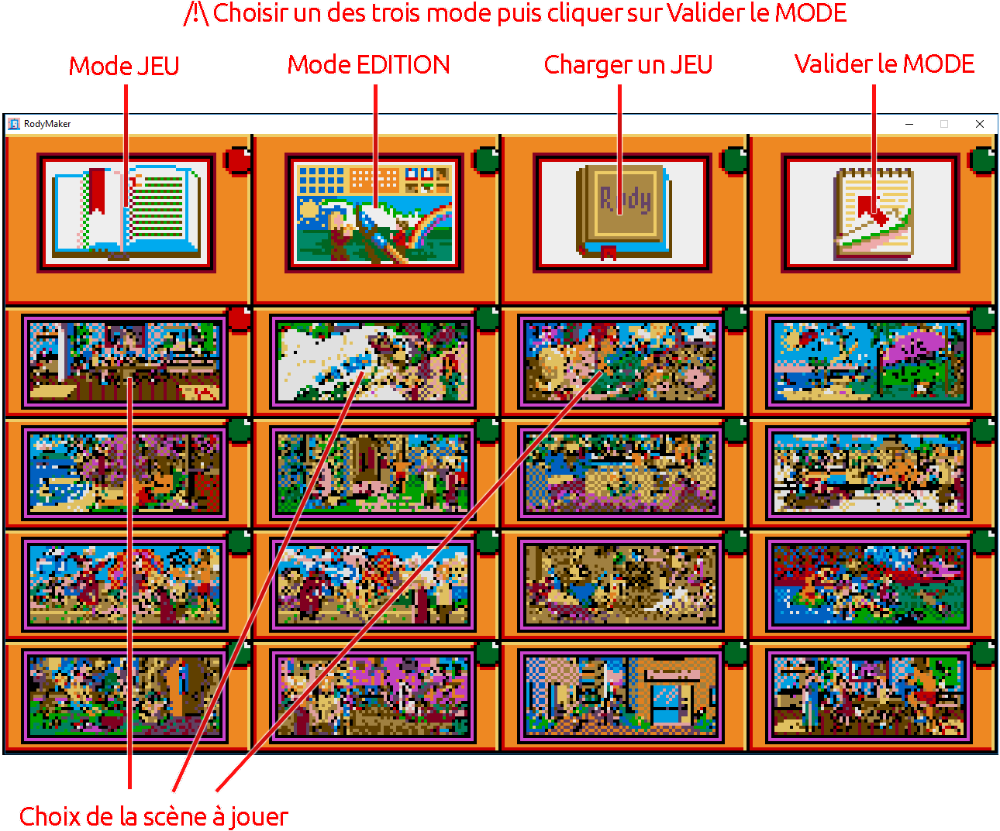
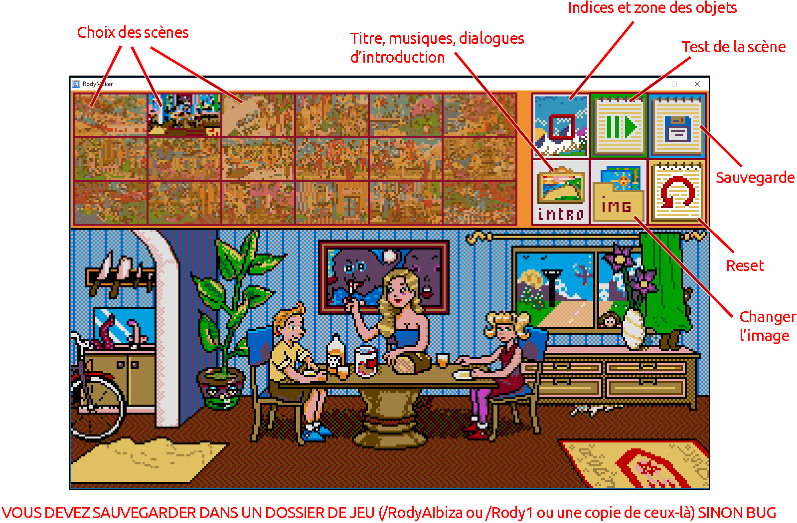
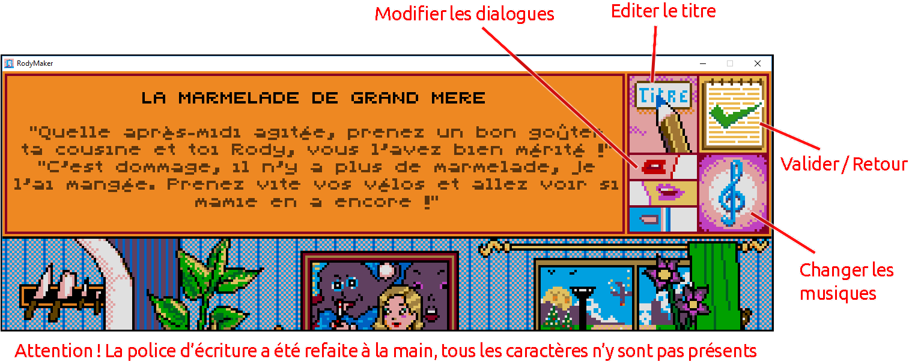
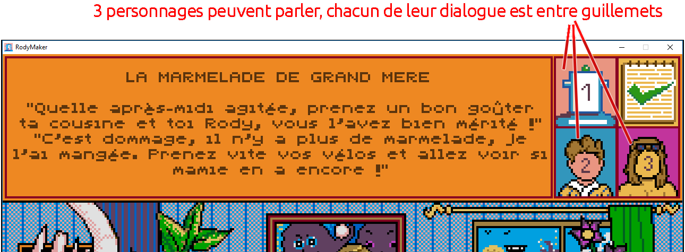
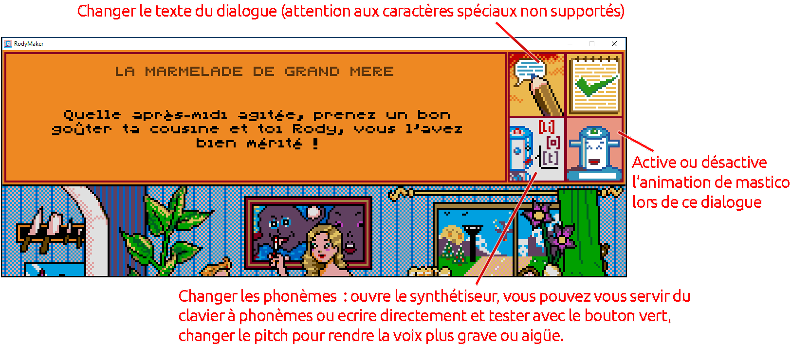
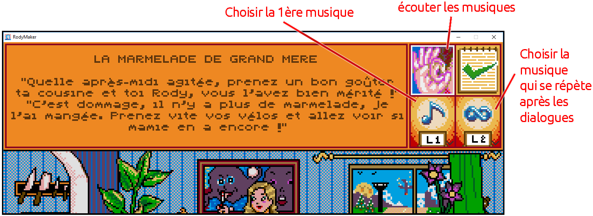
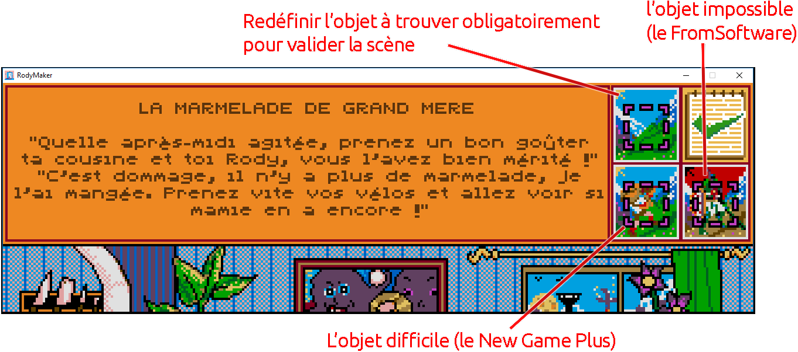
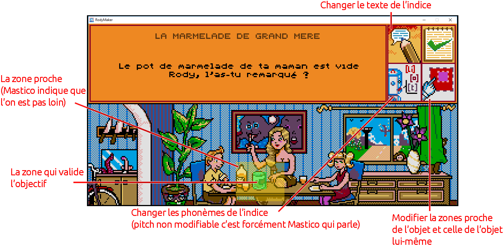

# Rody Maker - Tutoriel Complet

> Creez vos propres aventures Rody & Mastico avec l'editeur de niveaux integre.

---

## Table des matieres

1. [Pour commencer](#pour-commencer)
2. [Le Hub de Scenes](#le-hub-de-scenes)
3. [L'Editeur de Scene](#lediteur-de-scene)
4. [Editer les Images](#editer-les-images)
5. [Editer l'Introduction](#editer-lintroduction)
6. [Le Synthetiseur Vocal](#le-synthetiseur-vocal)
7. [Editer les Objets](#editer-les-objets)
8. [Sauvegarder et Tester](#sauvegarder-et-tester)
9. [Ressources Bonus](#ressources-bonus)

---

## Pour commencer

### Acceder a Rody Maker

Rody Maker est integre directement dans Rody Collection. Pour y acceder :

1. **Depuis le menu principal** : Cliquez sur "Creer un nouveau" pour commencer un nouveau jeu
2. **Depuis n'importe quel jeu** : Cliquez sur l'icone **pinceau** pour entrer en mode edition

> **Attention !** L'entree en mode edition est assez brutale - ca coupe la scene en cours ^^'

### Creer un nouveau jeu

1. Cliquez sur le bouton **"Creer un nouveau"** dans le menu principal
2. Entrez un titre pour votre jeu (ex: "Le Manoir de Mortevielle" pour la reference a Lankhor !)
3. Choisissez une image de couverture (celle qui apparaitra dans le menu)
4. Vous etes emmene directement dans l'editeur avec une page blanche

C'est l'ecran titre du jeu et forcement y'a rien, mais du coup on peut directement tout faire !

### Importer un jeu

Un bouton **"Importer"** permet de charger un fichier `.rody.json` (envoye par un ami) pour l'editer ou y jouer.

---

## Le Hub de Scenes



Quand vous entrez dans Rody Maker, vous arrivez sur le hub de scenes. Une grille affiche toutes les scenes du jeu (de 16 a 29 scenes supportees).

### Les 4 boutons principaux

| Bouton | Fonction |
|--------|----------|
| **Mode JEU** (Livre) | Jouer la scene selectionnee |
| **Mode EDITION** (Interface coloree) | Modifier la scene selectionnee |
| **Charger un JEU** (Dossier Rody) | Changer de jeu a editer |
| **Valider le MODE** (Bloc-note) | Confirmer et entrer dans le mode choisi |

> **Important** : Choisissez un des trois modes puis cliquez sur "Valider le MODE" pour confirmer.

### Selectionner une scene

Cliquez simplement sur une scene dans la grille pour la selectionner. Elle sera surlignee en rose.

---

## L'Editeur de Scene



Une fois en mode edition, vous voyez l'editeur principal avec :

### Zone superieure
- **Choix des scenes** : Vignettes de toutes les scenes en haut

### Zone centrale
- **Apercu de la scene** : L'image principale de la scene en cours d'edition

### Barre d'outils (a droite)

| Bouton | Fonction |
|--------|----------|
| **Objets** (Cadre avec zones) | Indices et zones des objets a trouver |
| **Test** (Fleche verte) | Tester la scene |
| **Sauvegarde** (Disquette) | Enregistrer les modifications |
| **INTRO** | Titre, musiques, dialogues d'introduction |
| **IMG** | Changer les images de la scene |
| **Reset** (Fleche rouge) | Annuler les modifications |

> **ATTENTION** : Vous devez sauvegarder dans un dossier de jeu (`/RodyAIbiza` ou `/Rody1` ou une copie de ceux-la) sinon BUG !

---

## Editer les Images

Cliquez sur **IMG** pour acceder a l'edition des images.

### Structure des fichiers

Chaque scene necessite :
- **1 image de base** : L'image principale de la scene
- **0 a 6 images d'animation** : Ces images defilent en boucle lorsqu'un personnage (autre que Mastico) parle

### Convention de nommage

Les images suivent le format : `{scene}.{frame}.png`

| Frame | Utilisation |
|-------|-------------|
| `.1` | Image principale de la scene |
| `.2` | Image d'animation 1 |
| `.3` | Image d'animation 2 |
| `.4` | Image d'animation 3 |
| `.5` | Image d'animation 4 |
| `.6` | Image d'animation 5 |

### Specifications techniques

- **Dimensions** : 320x130 pixels (zone de scene)
- **Couverture** : 320x200 pixels
- **Palette** : 16 couleurs (utilisez `palette_rody.png` ou `.act` du dossier Assets)

---

## Editer l'Introduction

Cliquez sur **INTRO** pour editer l'introduction de la scene.



### Interface du menu Intro

| Bouton | Fonction |
|--------|----------|
| **Titre** (Crayon) | Editer le titre de la scene |
| **Dialogues** (Bouche) | Modifier les dialogues |
| **Musique** (Note) | Changer les musiques |
| **Valider/Retour** (Coche verte) | Confirmer et revenir |

### Editer le titre

1. Cliquez sur le bouton **Titre** (avec le crayon)
2. Le titre devient modifiable
3. Tapez votre nouveau titre
4. Cliquez sur **Valider** pour confirmer

> **Attention !** La police d'ecriture a ete refaite a la main, tous les caracteres n'y sont pas presents. Evitez les caracteres speciaux non supportes.

### Editer les dialogues



**3 personnages peuvent parler**, chacun de leur dialogue est delimite par des guillemets automatiques.

Cliquez sur les boutons **1**, **2** ou **3** pour editer le dialogue de chaque personnage.



Pour chaque dialogue :

| Element | Description |
|---------|-------------|
| **Zone de texte** | Le texte affiche a l'ecran |
| **Bouton [L1]** | Changer les phonemes (synthese vocale) |
| **Interrupteur Mastico** | Active/desactive l'animation de Mastico lors de ce dialogue |

> **Interrupteur Mastico** :
> - **ON** (bleu) : Mastico s'anime pendant ce dialogue
> - **OFF** : Les images du decor s'animent a la place

### Editer la musique



Le choix des musiques s'effectue par deux boutons :

| Bouton | Fonction |
|--------|----------|
| **L1** | Choisir la 1ere musique (apparition de la scene) |
| **L2** | Choisir la musique qui se repete apres les dialogues |

Cliquez sur l'icone **oreille** pour ecouter les musiques disponibles.

---

## Le Synthetiseur Vocal

Le synthetiseur de phonemes recree la synthese vocale de l'Atari ST. C'est le coeur de la creation de dialogues authentiques !

### Comment ca marche

A l'aide des touches du synthetiseur, vous recreez la synthese vocale phrase par phrase. Chaque touche correspond a un **phoneme**, c'est-a-dire un son prononcable dans la langue francaise.

**Vous pouvez :**
- Vous servir du clavier a phonemes
- Ecrire directement dans la zone de texte
- Tester avec le bouton vert
- Changer le pitch pour rendre la voix plus grave ou aigue

### Controles du synthetiseur

| Controle | Fonction |
|----------|----------|
| **Clavier phonemes** | Cliquez sur chaque phoneme |
| **Zone de texte** | Editez directement la chaine |
| **Bouton vert** | Tester/ecouter le resultat |
| **Slider pitch** | Voix aigue (haut) ou grave (bas) |

### Syntaxe des phonemes

- Les phonemes sont separes par des underscores (`_`)
- Les mots sont separes par des espaces
- Les pauses doubles s'ecrivent avec double underscore (`__`)

### Exemples

| Phrase | Phonemes |
|--------|----------|
| "Bravo" | `b_r_a_v_o` |
| "Oui, c'est bien" | `ouu_i _ s_et_b_i_un` |
| "Cherche encore" | `ch_ai_r_ch_an_c_oh_r` |

### Phonemes disponibles (~40)

**Voyelles** : `a`, `i`, `u`, `ou`, `o`, `oh`, `e`, `et`, `ai`, `eu`, `ee`

**Voyelles nasales** : `an`, `on`, `in`, `un`

**Consonnes** : `b`, `p`, `d`, `t`, `g`, `c`, `m`, `n`, `gn`, `l`, `r`, `f`, `v`, `s`, `z`, `ch`, `j`

**Semi-voyelles** : `y`, `oi`, `ui`

**Speciaux** : `rien` (silence), `rienp` (pause), `bruitBlanc` (bruit blanc)

### Pitch recommande

- **Haut** = Voix aigue (Rody, enfants)
- **Milieu** = Voix normale (Mastico)
- **Bas** = Voix grave (monstres, adultes)

---

## Editer les Objets

Cliquez sur le bouton **Objets** (cadre avec zones) pour definir les objets a trouver.

### Les 3 slots d'objets



Chaque scene a **3 slots d'objets** :

| Position | Type | Description |
|----------|------|-------------|
| **Haut-Droit** | Obligatoire | L'objet a trouver pour valider la scene |
| **Bas-Gauche** | Difficile | L'objet "New Game+" (bonus) |
| **Bas-Droit** | Impossible | L'objet "FromSoftware" (super cache !) |

### Editer un objectif



Pour chaque objectif, vous pouvez modifier :

| Element | Description |
|---------|-------------|
| **Texte de l'indice** | Ce que Mastico dit comme indice |
| **Phonemes de l'indice** | La synthese vocale de l'indice |
| **Zones** | La zone proche et la zone de validation |

> **Note** : Le pitch n'est pas modifiable pour les indices - c'est forcement Mastico qui parle !

### Definir les zones

Chaque objet a **deux zones** :

1. **Zone proche** (grand rectangle) : Quand le joueur clique dedans, Mastico indique qu'on n'est pas loin ("Tu chauffes !")
2. **Zone de validation** (petit rectangle) : La zone exacte a cliquer pour trouver l'objet

**Comment dessiner :**
1. Cliquez sur le bouton **Zone** (cadre rouge)
2. **Phase 1** : Dessinez la zone proche (clic pour commencer, clic pour finir)
3. **Phase 2** : Dessinez la zone de validation (doit etre dans la zone proche)
4. **Clic droit** pour effacer et recommencer
5. Cliquez sur **Valider** quand vous etes satisfait

```
┌─────────────────────────────┐
│      Zone proche            │
│   (declenche "Tu chauffes") │
│   ┌─────────────────┐      │
│   │ Zone validation │      │
│   │  (trouve !)     │      │
│   └─────────────────┘      │
└─────────────────────────────┘
```

---

## Sauvegarder et Tester

### Sauvegarder

1. Cliquez sur le bouton **Sauvegarde** (disquette)
2. La premiere fois, selectionnez un dossier de jeu valide
3. Les fois suivantes, ca sauvegarde directement sans redemander

> **Important** : Quand on clique sur enregistrer, ca va directement enregistrer dans le jeu qu'on vient de creer. On n'a plus besoin de se compliquer la vie a manipuler les dossiers a la main !

### Tester

1. Cliquez sur le bouton **Test** (fleche verte)
2. La scene se lance en mode jeu
3. Cliquez sur le **pinceau** pour revenir a l'editeur

### Workflow recommande

1. Faire des modifications
2. Sauvegarder (disquette)
3. Tester (fleche verte)
4. Cliquer sur le pinceau pour revenir
5. Repeter !

---

## Ressources Bonus

L'archive du jeu contient des assets bonus dans le dossier `Assets/` :

### Musique
Toutes les pistes de musique Atari ST originales des Rody.

### Palette de couleurs

**Pour Photoshop :**
1. Allez dans le menu des palettes de couleurs
2. Cliquez sur "Remplacer palette"
3. Selectionnez le type de fichier : ACT
4. Choisissez le fichier de palette

**Alternative :** Utilisez `palette_rody.png` - contient les 16 couleurs directement.

### Police

`rody.ttf` - La police originale Rody & Mastico, recreee pixel par pixel.

> **Attention** : La police ne contient pas tous les caracteres speciaux !

**Ajouter des caracteres manquants :**
1. Allez sur https://www.pentacom.jp/pentacom/bitfontmaker2/
2. Cliquez sur "Import TTF"
3. Selectionnez `rody.ttf`
4. Cliquez sur "Open in BitFontMaker2"
5. Les cases vides = caracteres manquants
6. Dessinez les caracteres manquants
7. Cliquez sur "Build Font" pour telecharger le nouveau TTF

---

## Partager vos creations

### Format de sauvegarde
Vos jeux sont sauvegardes en fichiers `.rody.json`. Ce format portable contient tout : scenes, images, dialogues.

### Partager un jeu
1. Sauvegardez votre jeu (bouton disquette)
2. Choisissez un emplacement sur votre ordinateur
3. Envoyez le fichier `.rody.json` a un ami (email, cloud, cle USB)

### Installer un jeu recu
1. Cliquez sur le bouton **"Importer"** dans le menu principal
2. Selectionnez le fichier `.rody.json` recu

### Partage collaboratif

On peut faire un Dropbox/Google Drive collaboratif ou on met tous nos fichiers `.rody.json` et comme ca on peut telecharger les jeux des autres facilement !

Si vous faites de nouvelles histoires, dites-le moi sur Twitter, YouTube, Facebook, n'importe ! Et si les histoires sont vraiment bien, je les integrerai directement dans le jeu.

---

## Obtenir de l'aide

- **Video tutoriel** : https://www.youtube.com/watch?v=1vx8D2irVLI
- **Page itch.io** : https://lacrearthur.itch.io/rody-mastico-collection
- **Signaler des problemes** : Laissez un commentaire sur itch.io ou YouTube

N'hesitez pas a me faire des suggestions ou a reporter des bugs dans les commentaires !
